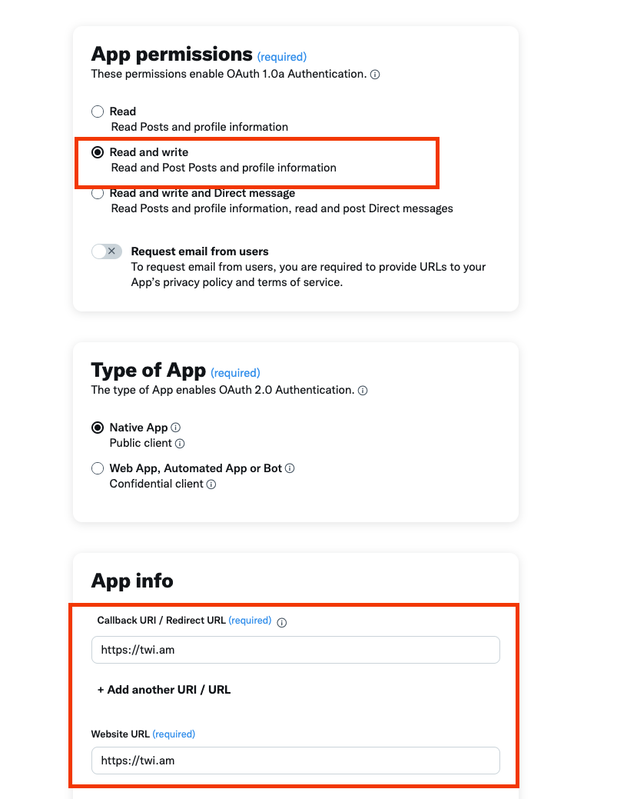
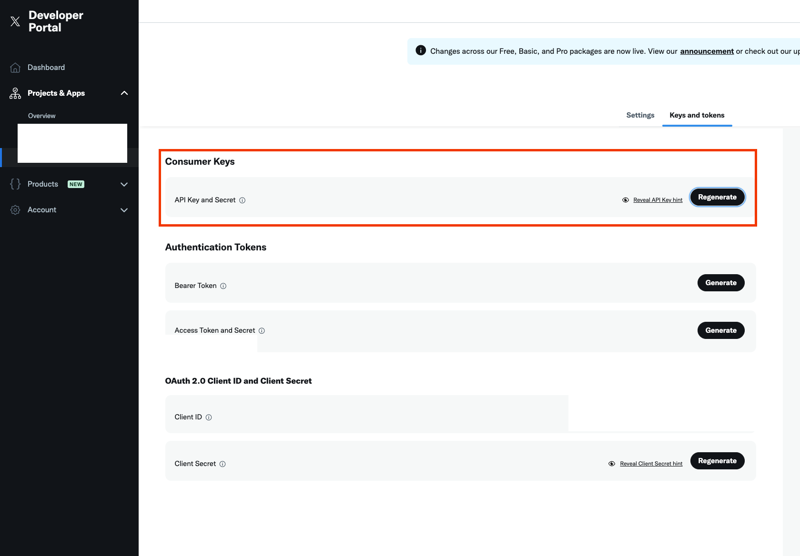
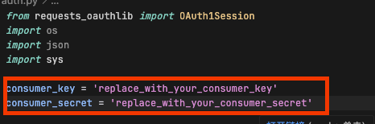
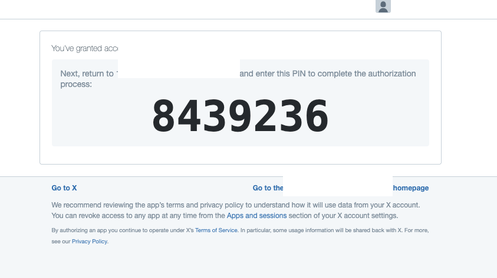

## X (formerly Twitter) Dify Plugin

**Author:** [Steven Lynn](https://github.com/stvlynn)
**Version:** 0.0.1
**Type:** tool

### Description

This plugin allows you to interact with the X (formerly Twitter) platform through their official API. 

It provides tools to send and delete tweets.

### Features

- **Post Tweet**: Send tweets to your X account and receive the tweet ID in response
- **Delete Tweet**: Delete tweets by their ID
- **Post Media Tweet**: Send tweets with media attachments (images or videos)

### Setup

1. Create a developer account at [X Developer Portal](https://developer.twitter.com/)
2. Create a project and app to obtain your API keys:
   - Go to the [Developer Portal Dashboard](https://developer.twitter.com/en/portal/dashboard)
   - Click "Create Project" and follow the steps
   
   - Within your project, create an app to get your API keys and tokens
   - Navigate to the "Keys and tokens" section to find your Consumer Keys (API Key and Secret)
   
3. Set up authentication:
   - Clone this repository to your local machine:
     ```
     git clone https://github.com/stvlynn/X-Dify-Plugin.git
     cd X-Dify-Plugin
     ```
   - Edit the `auth.py` file and fill in your Consumer Key and Secret
   
   - Run the authentication script:
     ```
     python auth.py
     ```
   - The script will provide an authorization URL. Open it in your browser
   - Authorize your application and enter the verification code when prompted
   
   - The script will output your ACCESS_TOKEN and ACCESS_TOKEN_SECRET
4. Configure the plugin in Dify:
   - Install the X Plugin from the Dify Marketplace
   - In the plugin settings, enter the following credentials:
     - **API Key**: Your X API Key (Consumer Key)
     - **API Secret**: Your X API Secret (Consumer Secret)
     - **Access Token**: OAuth 1.0a Access Token generated from auth.py
     - **Access Token Secret**: OAuth 1.0a Access Token Secret generated from auth.py

### Authentication Notes

- All credentials are stored securely and used only for authenticating with the X API
- You need Read and Write permissions for your app to post and delete tweets
- To verify your credentials are working, the plugin will make a test API call to the X API

### Usage

#### Posting a Tweet


```json
{
  "text": "Your tweet content here"
}
```

Response:
```json
{
  "status": "success",
  "tweet_id": "1234567890123456789",
  "text": "Your tweet content here",
  "message": "Tweet published successfully with ID: 1234567890123456789"
}
```

#### Deleting a Tweet


```json
{
  "tweet_id": "1234567890123456789"
}
```

Response:
```json
{
  "status": "success",
  "message": "Tweet with ID 1234567890123456789 deleted successfully"
}
```

#### Posting a Media Tweet

This action allows you to upload and attach media (images or videos) to your tweets.


Parameters:
- `text`: The text content of your tweet (max 280 characters)
- `media`: The media file to attach (image or video)

Supported media formats:
- Images: JPEG, PNG, GIF
- Videos: MP4 (H.264 codec recommended)

Note: Videos may take longer to process on X platform before the tweet is published.

```json
{
  "text": "Check out this awesome media!",
  "media": [Binary file data]
}
```

Response:
```json
{
  "status": "success",
  "tweet_id": "1234567890123456789",
  "text": "Check out this awesome media!",
  "media_id": "9876543210987654321",
  "message": "Tweet with media published successfully with ID: 1234567890123456789"
}
```

## Feedback and Issues

If you encounter any problems or have suggestions for improvements:

1. Please open an issue in the [plugin's GitHub repository](https://github.com/stvlynn/X-Dify-Plugin/issues)

2. Provide details about your problem, including error messages and steps to reproduce

3. **Do not** submit issues to the main [Dify](https://github.com/langgenius/dify) repository for plugin-specific problems

## License

[MIT](./LICENSE)